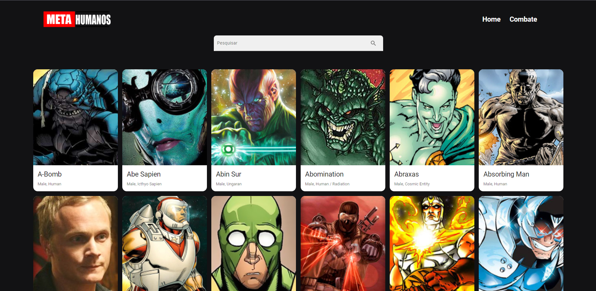

<h1 align="center">
    
</h1>

<br>

## 🦸 Meta Humanos

Meta Humanos é uma aplicação, onde você tem uma coleção de meta-humanos a sua disposição.
- Visualizar os meta-humanos
- Filtar os meta-humanos por nome;
- Visualizar os detalhes de cada meta-humano, após clicar em um deles;
- Iniciar um combate contra um meta-humano, após clicar em Combate;

## 🛠 Tecnologias

Esse projeto foi desenvolvido com as seguintes tecnologias:

- ReactJS ( React Hooks, ContextAPI )
- Typescript
- React-Router
- React-Modal
- Toastify
- SASS
- Material-UI
- ESLint
- Prettier


## 🚀 Como executar

Clone o projeto e acesse a pasta do mesmo.

```bash
$ git clone git@github.com:luizsmatos/meta-humans.git
$ cd meta-humans
```

Para iniciá-lo, siga os passos abaixo:
```bash
# Instalar as dependências
$ yarn / npm install

# Iniciar o projeto
$ yarn start / npm start
```

---
